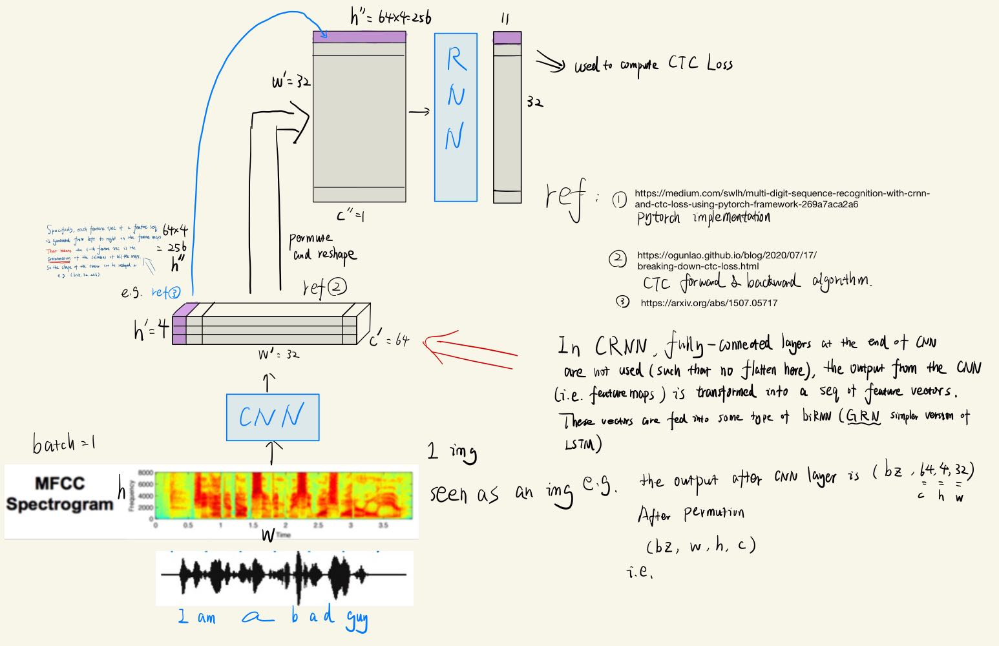

<!-- vscode-markdown-toc -->
* 1. [Why we need CTC? ---> looking back on history](#WhyweneedCTC---lookingbackonhistory)
	* 1.1. [About CRNN](#AboutCRNN)
	* 1.2. [from Cross Entropy Loss to CTC Loss](#fromCrossEntropyLosstoCTCLoss)
* 2. [Details about CTC](#DetailsaboutCTC)
	* 2.1. [intuition: forward algorithm](#intuition:forwardalgorithm)
	* 2.2. [implementation: forward algorithm with dynamic programming](#implementation:forwardalgorithmwithdynamicprogramming)
		* 2.2.1. [dummy input ---> what the input looks like](#dummyinput---whattheinputlookslike)
		* 2.2.2. [expand the target ---> what the target matrix look like](#expandthetarget---whatthetargetmatrixlooklike)
	* 2.3. [Alpha Matrix](#AlphaMatrix)
	* 2.4. [Dynamic programming based on 3 conditions](#Dynamicprogrammingbasedon3conditions)

<!-- vscode-markdown-toc-config
	numbering=true
	autoSave=true
	/vscode-markdown-toc-config -->
<!-- /vscode-markdown-toc --># TOC


Before reading<br>
the tutorial is a collection of many other resources and my own notes. Note that the ref if any in the tutorial means the whole passage. And part to be referred if any means the part has been summarized or detailed by me. Feel free to click the \[the part to be referred\] to read the original.


# CTC_pytorch
##  1. <a name='WhyweneedCTC---lookingbackonhistory'></a>Why we need CTC? ---> looking back on history
Feel free to skip it if you already know the purpose of CTC coming into being.

###  1.1. <a name='AboutCRNN'></a>About CRNN
We need to learn CRNN because in the context we need an output to be a sequence.


ref: [the overview from CRNN to CTC !! highly recommended !!](https://medium.com/swlh/multi-digit-sequence-recognition-with-crnn-and-ctc-loss-using-pytorch-framework-269a7aca2a6)

[part to be referred](https://medium.com/swlh/multi-digit-sequence-recognition-with-crnn-and-ctc-loss-using-pytorch-framework-269a7aca2a6#:~:text=reference%20OCR%20datasets.-,CRNN%20architecture,-In%20essence%2C%20the)


multi-digit sequence recognition
- Characted-based
- word-based
- sequence-to-sequence 
- CRNN = CNN + RNN
    - CNN --> relationship between pixel
    - (the small fonts) Specifially, each feature vec of a feature seq is generated from left to right on the feature maps. That means the i-th feature vec is the concatenation of the columns of all the maps. So the shape of the tensor can be reshaped as e.g. (batch_size, 32, 256)

<div align = center>
    
    <h4>image1</h4>
</div>


<br><br>

###  1.2. <a name='fromCrossEntropyLosstoCTCLoss'></a>from Cross Entropy Loss to CTC Loss

Usually, CE is applied to compute loss as the following way. And gt(also target) can be encoded as a stable matrix or vector.

<div align = center>
    
    <h4>image2</h4>

</div>

However, in OCR or audio recognition, each target input/gt has various forms. e.g. "I like to play piano" can be unpredictable in handwriting.
<div align = center>
    
    <h4>image3</h4>

</div>
Some stroke is longer than expected. Others are short.

<br>
Assume that the above example is encoded as number sequence [5, 3, 8, 3, 0].

<div align = center>
    
    <h4>image4</h4>

</div>

* Tips: blank(the blue box symbol here) is introduced because we allow the model to predict a blank label due to unsureness or the end comes, which is similar with human when we are not pretty sure to make a good prediction. ref:[lihongyi lecture](https://www.youtube.com/watch?v=CGuLuBaLIeI&t=1226s) starting from 3:45

Therefore, we see that this is an one-to-many question where e.g. "I like to play piano" has many target forms. But we not just have one sequence. We might also have other sequence e.g. "I love you", "Not only you but also I like apple" etc, none of which have a same sentence length. And this is what cross entropy cannot achieve in one batch. But now we can encode all sequences/sentences into a new sequence with a max length of all sequences.

e.g. <br>
"I love you" --> len = 10<br>
"How are you" --> len = 11<br>
"what's your name" --> len = 16<br>

In this context the input_length should be >= 16.

For dealing with the expanded targets, CTC is introduced by using the ideas of ***(1) HMM forward algorithm*** and ***(2) dynamic programing***.

##  2. <a name='DetailsaboutCTC'></a>Details about CTC 
###  2.1. <a name='intuition:forwardalgorithm'></a>intuition: forward algorithm 
<div align = center>
    
    <h4>image5</h4>

</div>

<div align = center>
    
    <h4>image6</h4>

</div>

Tips: the reason we have - inserted between each two token is because, for each moment/horizontal(Note) position we allow the model to predict a blank representing unsureness.

Note that moment is for audio recognition analogue. horizontal position is for OCR analogue.

<br><br>

###  2.2. <a name='implementation:forwardalgorithmwithdynamicprogramming'></a>implementation: forward algorithm with dynamic programming

the complete code is [CTC.py](CTC.py)

given 3 samples, they are<br>
"orange"     :[15, 18, 1,  14, 7, 5] &nbsp;&nbsp;&nbsp;len = 6<br>
"apple"      :[1,  16, 16, 12, 5]    &nbsp;&nbsp;&nbsp;len = 5<br>
"watermelon" :[[23, 1,  20, 5, 18, 13, 5, 12, 15, 14] &nbsp;len = 10<br>

{0:blank, 1:A, 2:B, ... 26:Z}
<br><br>


####  2.2.1. <a name='dummyinput---whattheinputlookslike'></a>dummy input ---> what the input looks like
```python
# ------------ a dummy input ----------------
log_probs = torch.randn(15, 3, 27).log_softmax(2).detach().requires_grad_()# 15:input_length  3:batchsize  27:num of token(class)
# targets = torch.randint(0, 27, (3, 10), dtype=torch.long)
targets = torch.tensor([[15, 18, 1,  14, 7, 5,  0, 0,  0,  0],
                        [1,  16, 16, 12, 5, 0,  0, 0,  0,  0],
                        [23, 1,  20, 5, 18, 13, 5, 12, 15, 14]]
                        )

# assume that the prediction vary within 15 input_length.But the target length is still the true length.
""" 
e.g. [a,0,0,0,p,0,p,p,p, ...l,e] is one of the prediction
 """
input_lengths = torch.full((3,), 15, dtype=torch.long)
target_lengths = torch.tensor([6,5,10], dtype = torch.long)
```
<br><br>

####  2.2.2. <a name='expandthetarget---whatthetargetmatrixlooklike'></a>expand the target ---> what the target matrix look like

Recall that one target can be encoded in many different forms. So we introduce a targets mat to represent it as follows. 

```python
target_prime = targets.new_full((2 * target_length + 1,), blank) # create a targets_prime full of zero

target_prime[1::2] = targets[i, :target_length] # equivalent to insert blanks in targets. e.g. targets = "dog" --> "-d-o-g-"
```

Now we got target_prime(also expanded target) for e.g. "apple"<br>
target_prime is<br>
tensor([ 0,  1,  0, 16,  0, 16,  0, 12,  0,  5,  0]) which is visualized as the red part(also t1)
<div align = center>
    
    <h4>image7</h4>
</div>

Note that the t8 is only for illustration. In the example, the width of target matrix should be 15(input_length).
<br><br>

```python
probs = log_probs[:input_length, i].exp()
```
Then we convert original inputs from log-space like this, referring to "In practice, the above recursion ..." in original paper https://www.cs.toronto.edu/~graves/icml_2006.pdf


###  2.3. <a name='AlphaMatrix'></a>Alpha Matrix
<div align = center>
    
    <h4> image8 </h4>
</div>

```python
# alpha matrix init at t1 indicated by purple boxes.
alpha_col = log_probs.new_zeros((target_length * 2 + 1,))
alpha_col[0] = probs[0, blank] # refers to green box
alpha_col[1] = probs[0, target_prime[1]]
```
- blank is the index of blank(here it's 0)
- target_prime[1] refers to the 1-st index of the token. e.g. "apple": "a", "orange": "o"

###  2.4. <a name='Dynamicprogrammingbasedon3conditions'></a>Dynamic programming based on 3 conditions
refer to the details in CTC.py


# reference:
- [introductory look](https://distill.pub/2017/ctc/)
- [forward algorithm and backward algorithm](https://ogunlao.github.io/blog/2020/07/17/breaking-down-ctc-loss.html)
- [original paper](https://www.cs.toronto.edu/~graves/icml_2006.pdf)
- [pytorch implementation](https://medium.com/swlh/multi-digit-sequence-recognition-with-crnn-and-ctc-loss-using-pytorch-framework-269a7aca2a6)


           


